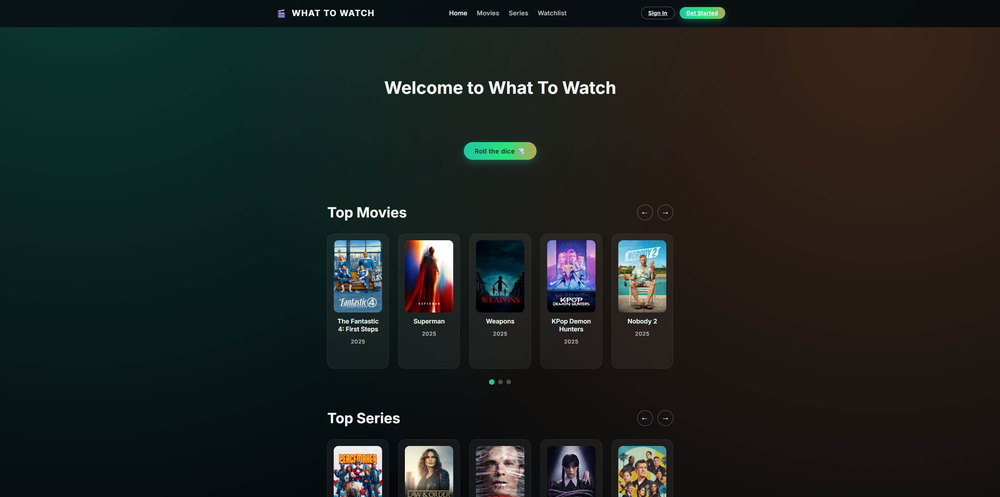

# What to Watch

Full-stack movie and TV series discovery app built with Node.js, Express 5, MongoDB, and a vanilla JavaScript frontend. Users can browse curated catalogs, authenticate, and manage a personal watchlist that lives in MongoDB.

**Live site:** https://project2.kushshah.net/

## Author

- Kush Shah
- Phillip Chandy

## Class Link

- [CS5610 Web Development (Fall 2025)](https://johnguerra.co/classes/webDevelopment_online_fall_2025/)

## Project Objective

Create a responsive companion site that showcases movies and television series, offers random recommendations, and lets authenticated users curate their own watchlist. The project demonstrates full-stack development skills including API design, persistence, authentication, and deployment.

## Screenshot



## Features

- Random MongoDB-backed movie suggestion on page load.
- Paginated browsing for both movies and series collections.
- User registration and authentication (email/password).
- Watchlist management with duplicate protection and timestamps.
- Responsive vanilla JS frontend served by the same Express server.

## Tech Stack

- **Backend:** Node.js, Express 5, MongoDB driver.
- **Database:** MongoDB (`WhatToWatch` database with `Movies`, `Series`, `users` collections).
- **Frontend:** Vanilla JavaScript, HTML, CSS (served from `frontend/`).
- **Tooling:** Nodemon for development reloads, ESLint + Prettier configs.

## Prerequisites

- Node.js 20+ and npm.
- MongoDB running locally on `mongodb://localhost:27017/`. Update the URI in `db/mongoDB.js` if your setup differs.

## Build & Run Locally

1. Install dependencies:
   ```bash
   npm install
   ```
2. Start MongoDB locally (or point the URI to your hosted cluster).
3. Launch the development server with Nodemon auto-reload:
   ```bash
   npm start
   ```
   > To run without Nodemon, execute `node backend/server.js`.
4. Open `http://localhost:3000/` in the browser to use the app.

## API Overview

| Method   | Route                                 | Description                                           |
| -------- | ------------------------------------- | ----------------------------------------------------- |
| `GET`    | `/api/get-random-movie`               | Returns a single random movie document.               |
| `GET`    | `/api/movies?page=<n>&pageSize=<m>`   | Paginated movie list (defaults: page=1, pageSize=50). |
| `GET`    | `/api/series?page=<n>&pageSize=<m>`   | Paginated TV series list.                             |
| `POST`   | `/api/register-user`                  | Create a user (`email`, `password`, `name`).          |
| `POST`   | `/api/auth-user`                      | Authenticate user credentials.                        |
| `GET`    | `/api/get-user-watchlist?userId=<id>` | Retrieve a user's watchlist.                          |
| `POST`   | `/api/add-to-user-watchlist`          | Add a movie/series to the watchlist.                  |
| `DELETE` | `/api/remove-from-user-watchlist`     | Remove a watchlist entry by movie ID.                 |

Watchlist requests expect MongoDB ObjectId strings for `userId`; movies and series use their imported identifiers.

## Project Structure

- `backend/` – Express server & route handlers.
- `frontend/` – Static assets, HTML pages, and client-side JavaScript.
- `db/` – Mongo helper module used by the API routes.
- `movies.json`, `tv_shows.json` – Seed data exports used by the API.
- `db/WhatToWatch.*.json` – Mongo collection exports for seeding Dockerized Mongo instances.

## Docker Deployment

1. Build and start the stack (Node + Mongo + persistent volume):
   ```bash
   docker compose up -d --build
   ```
2. On first boot the Mongo container seeds the `WhatToWatch` database using the JSON exports in `db/WhatToWatch.*.json` (fallback to `movies.json` / `tv_shows.json` if collection files are absent). Existing data is preserved on restarts.
3. The app container serves HTTPS only. Provide certificates at `/etc/ssl/certs/origin-cert.pem` and `/etc/ssl/private/private-key.pem`, or adjust `docker-compose.yml` to match your paths.
4. Access the site at `https://<host>/`. MongoDB remains reachable on `127.0.0.1:27017` for administration (e.g., `mongosh mongodb://127.0.0.1:27017/WhatToWatch`).
5. To rebuild and redeploy after changes:
   ```bash
   ./scripts/rebuild.sh
   ```

## Development Notes

- Authentication is currently plain email/password; add hashing and validation before production use.
- Default MongoDB URI is hardcoded in `db/mongoDB.js`; switch to environment variables for flexible deployments.

## License

MIT © Kush Shah & Phillip Chandy
